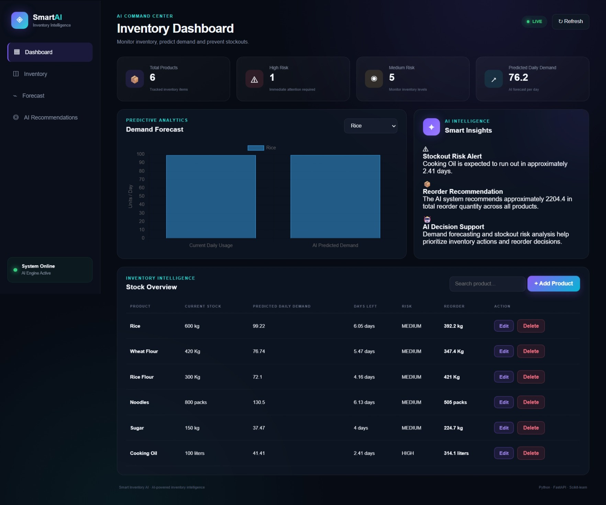
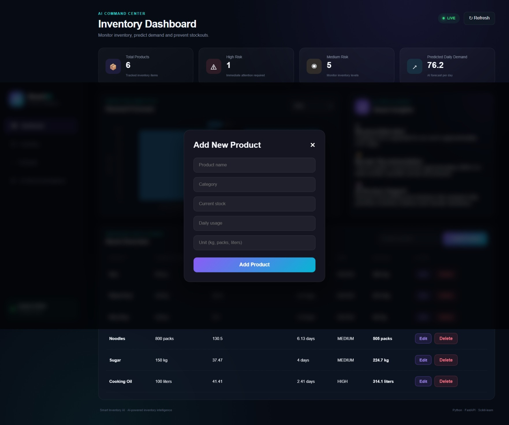
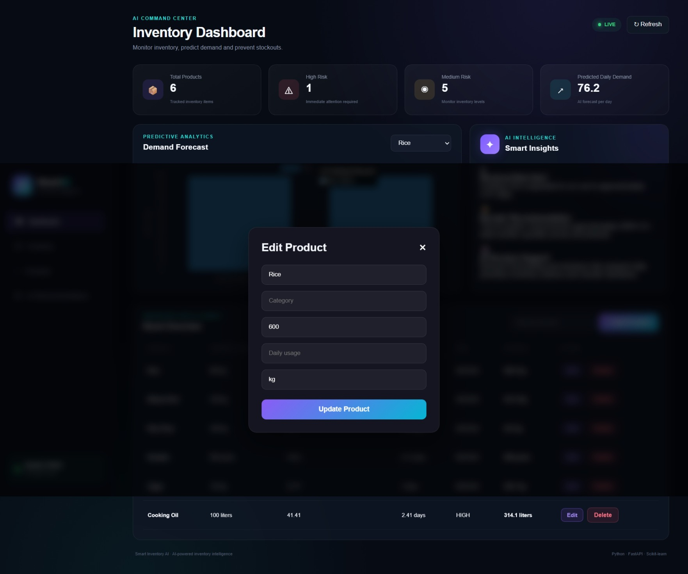

# Smart Inventory AI

> AI-powered inventory intelligence platform for demand forecasting, stockout risk prediction, and smart reorder recommendations.

Smart Inventory AI is a full-stack application that combines software engineering, REST API development, database management, data analysis, and machine learning to help businesses monitor inventory and make data-driven replenishment decisions.

The system analyzes inventory and historical demand data, forecasts future demand, estimates stockout risk, and provides actionable reorder recommendations through an interactive web dashboard.

---

## 🚀 Key Features

### 📦 Inventory Management

- Add new products
- Edit existing products
- Delete products
- View inventory records
- Search and filter products
- Track stock quantity, category, unit, and daily usage

### 🤖 AI & Machine Learning

- Historical demand analysis
- Product-level demand forecasting
- Future demand estimation using Scikit-learn
- Stockout risk prediction
- Estimated days until stockout
- ML-based reorder recommendations using demand forecasts and inventory rules

### 📊 Business Intelligence

- Inventory health monitoring
- High and medium stockout risk identification
- Predicted daily demand analysis
- Recommended reorder quantity
- Automated inventory insights

### 🌐 Full-Stack Application

- FastAPI REST backend
- SQLite database
- Interactive web dashboard
- JavaScript-based frontend
- Chart.js data visualization
- Frontend-backend API integration

---

## 🧠 System Workflow

```text
                    ┌─────────────────────┐
                    │    Web Dashboard    │
                    │  HTML/CSS/JS/Chart  │
                    └──────────┬──────────┘
                               │
                               ▼
                    ┌─────────────────────┐
                    │    FastAPI REST API │
                    │   Backend Services  │
                    └──────────┬──────────┘
                               │
                    ┌──────────┴──────────┐
                    ▼                     ▼
          ┌─────────────────┐   ┌─────────────────┐
          │ SQLite Database │   │ Historical Data │
          │ Inventory Data  │   │ Demand Data     │
          └────────┬────────┘   └────────┬────────┘
                   │                     │
                   └──────────┬──────────┘
                              ▼
                   ┌─────────────────────┐
                   │ ML Demand Forecast  │
                   │ Scikit-learn Model  │
                   └──────────┬──────────┘
                              ▼
                   ┌─────────────────────┐
                   │ Stockout Risk       │
                   │ Analysis            │
                   └──────────┬──────────┘
                              ▼
                   ┌─────────────────────┐
                   │ Reorder             │
                   │ Recommendation      │
                   └──────────┬──────────┘
                              ▼
                   ┌─────────────────────┐
                   │ Actionable Insights │
                   │ on Dashboard        │
                   └─────────────────────┘
```

---

## 📸 Dashboard Screenshots

### Dashboard



### Add Product



### Edit Product



---

## 🛠️ Technology Stack

| Category | Technology |
|---|---|
| Programming Language | Python |
| Backend Framework | FastAPI |
| Machine Learning | Scikit-learn |
| Data Processing | Pandas, NumPy |
| Database | SQLite |
| Frontend | HTML, CSS, JavaScript |
| Data Visualization | Chart.js |
| API | RESTful API |
| Version Control | Git, GitHub |
| Development Environment | Visual Studio Code |

---

## 🔌 API Endpoints

| Method | Endpoint | Description |
|---|---|---|
| GET | `/` | Check API status |
| POST | `/inventory` | Add a new product |
| GET | `/inventory` | Retrieve all inventory products |
| DELETE | `/inventory/{product_id}` | Delete a product |
| GET | `/inventory/{product_id}/stock-status` | Check stock status |
| GET | `/inventory/stock-analysis` | Analyze inventory health |
| GET | `/inventory/{product_name}/forecast` | Generate demand forecast |
| GET | `/inventory/{product_id}/smart-recommendation` | Generate AI reorder recommendation |
| GET | `/inventory/smart-recommendations` | Generate recommendations for all products |

---

## 🤖 Machine Learning Approach

The system uses historical product demand data to estimate future demand for each inventory item.

### Model

- Algorithm: Linear Regression
- Library: Scikit-learn
- Input: Historical daily demand
- Feature: Sequential day index
- Output: Estimated future daily demand

### Forecasting Process

1. Load historical demand data from CSV.
2. Filter data for the selected product.
3. Convert dates into sequential day values.
4. Train a Linear Regression model.
5. Estimate future daily demand.
6. Use the forecast to calculate stockout risk.
7. Generate a recommended reorder quantity.

### Inventory Decision Logic

The system combines the ML forecast with current inventory levels to estimate:

- Days until stockout
- Stockout risk level
- Forecast demand
- Safety stock requirement
- Recommended reorder quantity

This creates a simple **data → prediction → decision** workflow for inventory management.

---

### Limitations

- The current forecasting model uses a simple Linear Regression approach.
- Forecast accuracy depends on the quality and amount of historical demand data.
- Reorder recommendations are based on forecasted demand, current stock, and predefined safety-stock rules.
 

## ▶️ How to Run

### 1. Clone the Repository

```bash
git clone https://github.com/aathil-yaseen/smart-inventory-ai.git
cd smart-inventory-ai
```

### 2. Create a Virtual Environment

```bash
python -m venv venv
```

### 3. Activate the Virtual Environment

**Windows:**

```bash
venv\Scripts\activate
```

### 4. Install Dependencies

```bash
pip install -r requirements.txt
```

### 5. Start the FastAPI Backend

```bash
uvicorn backend.main:app --reload
```

The API will be available at:

```text
http://127.0.0.1:8000
```

### 6. Start the Frontend

Open another terminal and run:

```bash
python -m http.server 5501 --directory frontend
```

Open the dashboard at:

```text
http://127.0.0.1:5501
```

### 7. API Documentation

FastAPI provides interactive API documentation at:

```text
http://127.0.0.1:8000/docs
```

---

## 📁 Project Structure

```text

smart-inventory-ai/
│
├── backend/
│   ├── data/
│   │   └── demand_history.csv
│   ├── database.py
│   ├── main.py
│   ├── model.py
│   └── test_model.py
│
├── frontend/
│   ├── index.html
│   ├── style.css
│   └── script.js
│
├── ScreenShots/
│   ├── Dashboard.jpeg
│   ├── Add_product.jpeg
│   └── Edit_product.jpeg
│
├── .gitignore
├── README.md
└── requirements.txt
---
